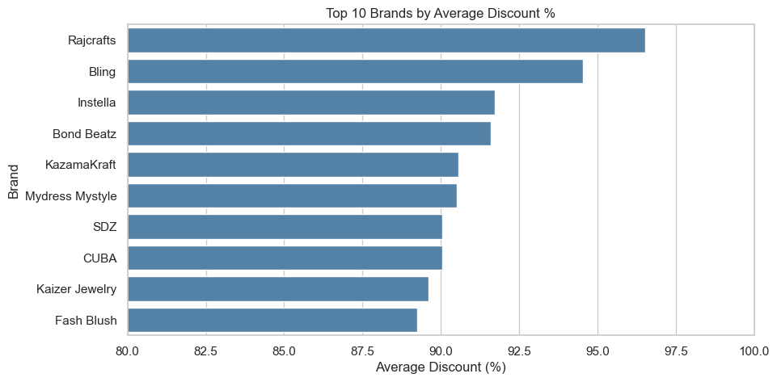
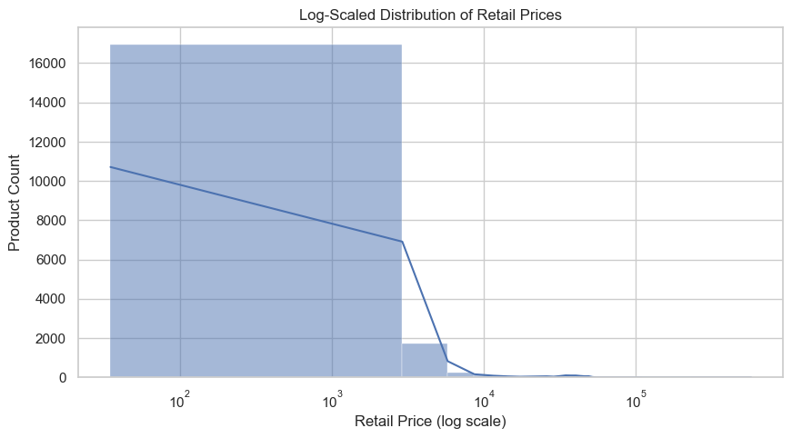
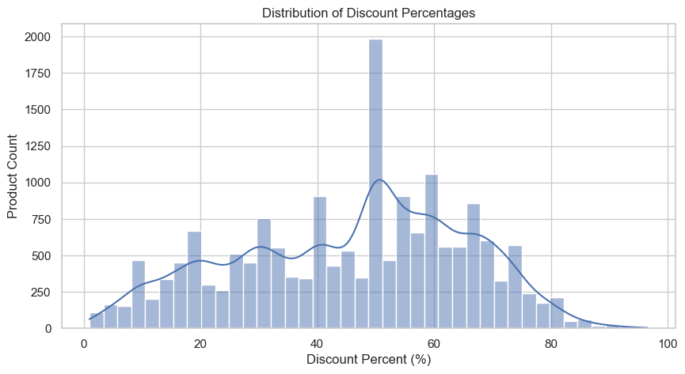
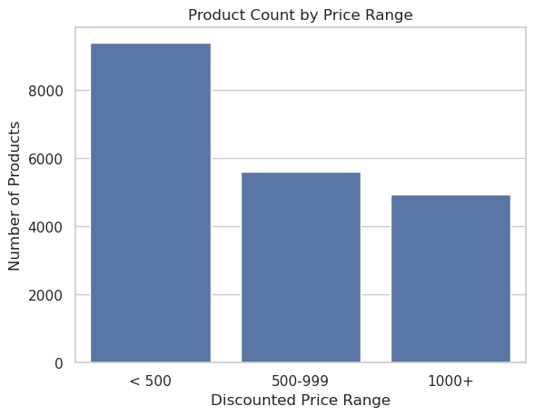
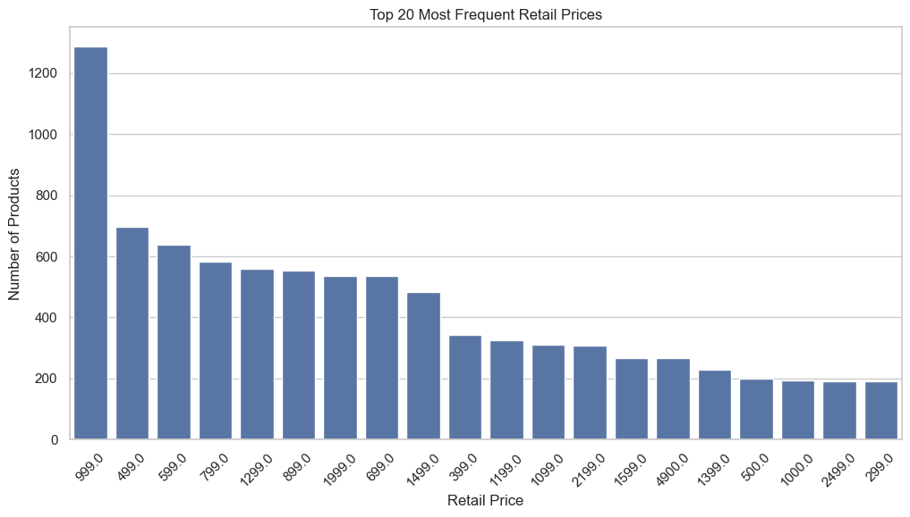
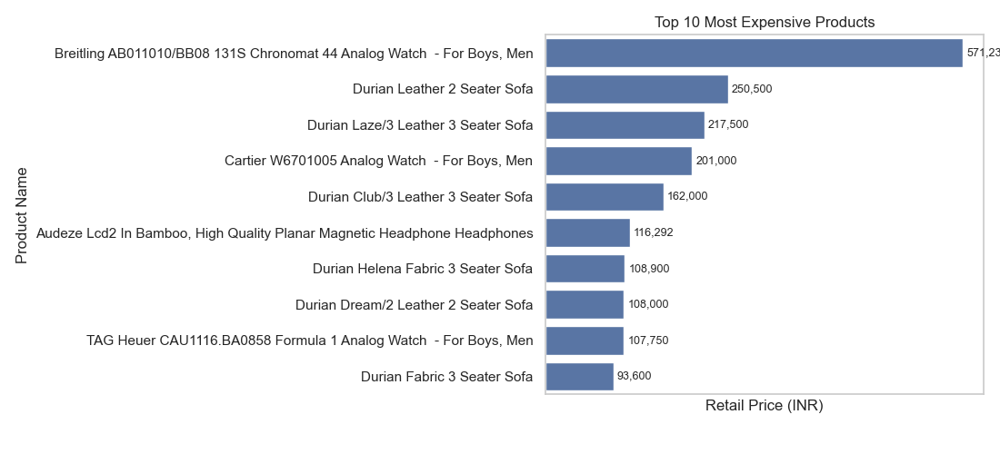
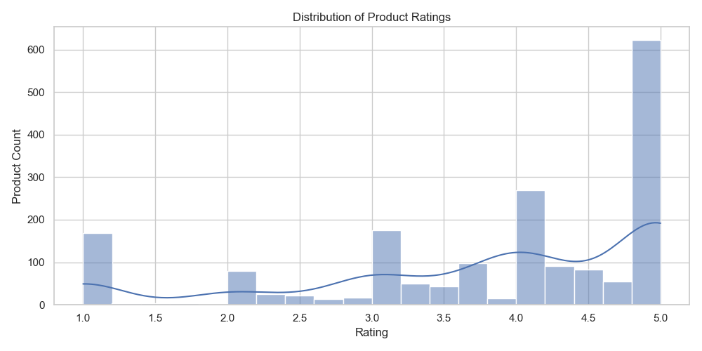
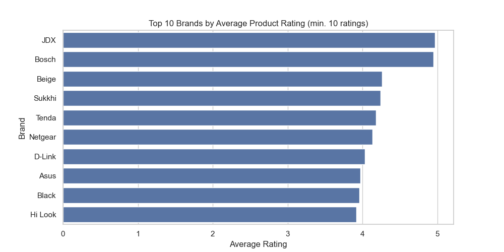
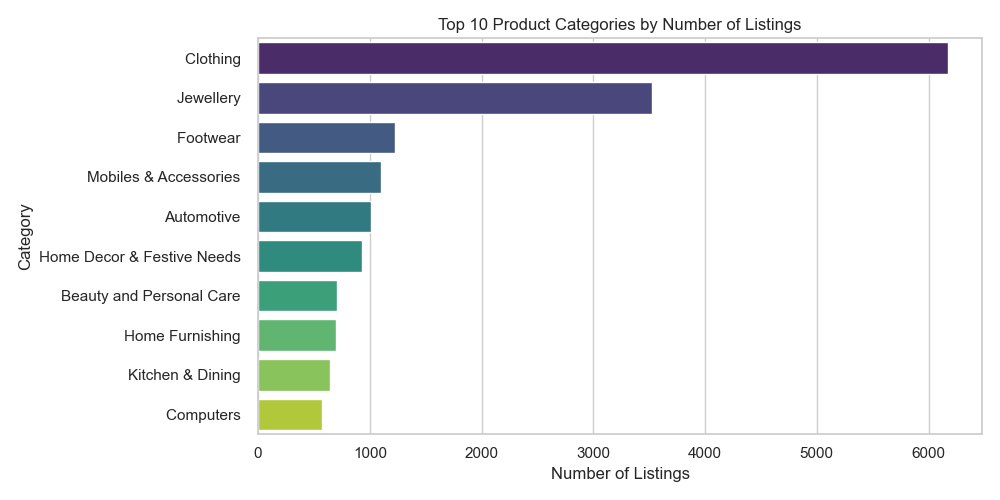

# 📦 Flipkart E-Commerce Product Analysis

This project involves exploratory data analysis (EDA) on a dataset of ~20,000 Flipkart product listings. The goal is to uncover insights related to product pricing, discounts, brand trends, and ratings using Python and pandas.

---

## 📂 Dataset Summary

- **Rows:** 20,000 (cleaned to 19,917)
- **Columns:** 15
- **Source:** Flipkart product scraping (public dataset)
- **Key Columns:** `product_name`, `brand`, `retail_price`, `discounted_price`, `product_rating`, `product_category_tree`

---

## 🧹 Data Cleaning Steps

- Dropped rows with missing `retail_price`, `discounted_price`, `image`, or `description`
- Converted ratings from `"No rating available"` to `NaN` and cast to `float`
- Dropped duplicates
- Filled missing brands with `"Unknown"`
- Resulting clean dataset: `flipkart_cleaned.csv` (19,917 rows)

---

## 🎯 Business Questions Explored

### ✅ 1. Which brands offer the most discounted products (by average %)?

We computed average discount percentage for each brand and identified the **Top 10 brands** with the highest discounts — most of them offer over 85% average discount.



---

### ✅ 2. What is the distribution of products across different price ranges?

We categorized products into price ranges (`<500`, `500-999`, `1000+`) and calculated the **average discount %** within each range. Surprisingly, **lower-priced products had higher average discounts**.


---

### ✅ 3. What is the distribution of retail prices and discount percentages?

- **Retail prices** are highly right-skewed with most products priced under ₹2000.
- **Discount percentages** peaked around 0% and 60%, with many products offering flat discounts.

  


---

### ✅ 4. What is the count of products by discounted price ranges?

We grouped discounted prices into logical bins and found the highest number of products are priced under ₹500 after discounts.



---

### ✅ 5. What are the top 10 most expensive products on Flipkart?

We sorted the dataset by retail price and displayed the top 10 distinct products. Luxury watches and high-end furniture dominate the list.

  


---

### ✅ 6. How are product ratings distributed?

We observed a **clear spike at 5.0 ratings**, suggesting either strong user satisfaction or a bias in rating availability. Very few products had ratings between 2–4.5.



---

### ✅ 7. Which brands have the highest average ratings (min. 10 rated products)?

Only brands with at least 10 rated products were considered. This filtered out noise and helped highlight consistent performers.



---

### ✅ 8. Which product categories have the highest number of listings?

"Clothing", "Jewellery", and "Footwear" dominate the platform in terms of volume. These top 10 categories capture most of Flipkart's inventory.



---

## 📊 Tools & Libraries

- **Language:** Python (Jupyter Notebook)
- **Libraries:** pandas, numpy, matplotlib, seaborn
- **IDE:** JupyterLab / VS Code

---

## 📁 Project Structure

```
Flipkart-Ecommerce-Analysis/
├── data/
│   └── flipkart_cleaned.csv
├── notebooks/
│   ├── 01_data_cleaning.ipynb
│   └── 02_eda_analysis.ipynb
├── visuals/
│   └── *.png (charts shown above)
└── README.md
```

---

## ✅ Conclusion

This EDA project explored Flipkart's e-commerce product data and uncovered key insights related to pricing trends, discount strategies, and brand performance. The analysis revealed that:

- Products are heavily skewed toward lower price ranges.
- Many brands offer extremely high discounts (especially low-priced items).
- Ratings are sparse and often maxed out at 5.0, suggesting possible bias or limited engagement.
- Categories like Clothing, Jewellery, and Footwear dominate the product listings.

This project demonstrates the power of pandas and visual storytelling in uncovering business-relevant patterns from raw e-commerce data.

## 🤝 Contact

Made with 💻 by [Aryavardhan Jain](https://www.linkedin.com/in/aryavardhanjain/)  
📫 jainaryan418@gmail.com  
🔗 [GitHub](https://github.com/aryavardhanjain)
